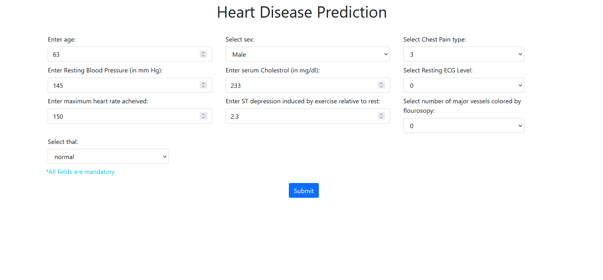
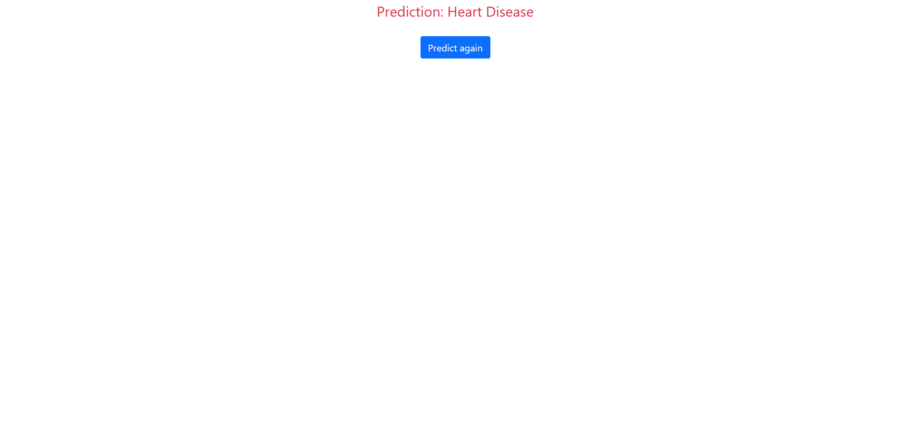
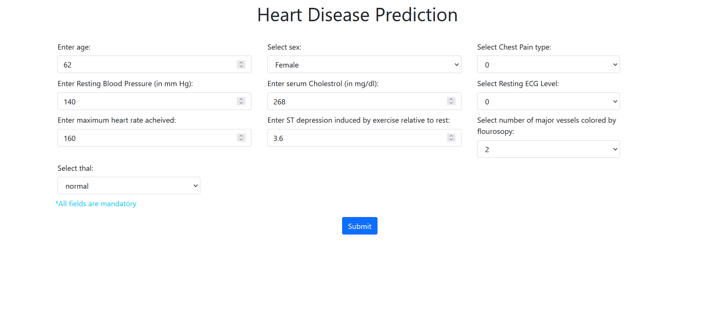
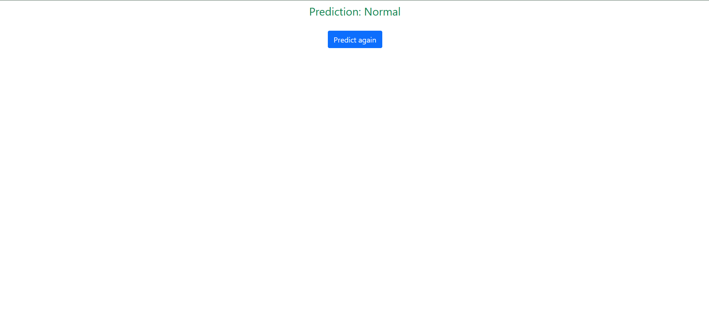

# Heart disease prediction web application

> This application predicts the presence of heart disease in a patient using an underlying supervised machine learning classification model.
> It considers patient's different test parameters and predicts a binary response [Normal, Heart Disease].
> The model was trained on a publicly available dataset after comparing different models on the basis of accuracy score and hyperparameter tuning.
> The data was preprocessed (feature selection) before feeding in the model.  
> Dataset: [Kaggle](https://www.kaggle.com/ronitf/heart-disease-uci)

---

### Technologies used:
1. Python
2. scikit-learn/Matplotlib (building model & data visualization)
3. Flask (web application)
4. HTML/CSS/Bootstrap (frontend)
5. Heroku (deployment)

---

<!--- ### Ideas --->

### Examples:
##### Example 1:

##### Example 2:

---

#### Predict here: [Website Link](http://heart-disease-web-prediction.herokuapp.com/)
